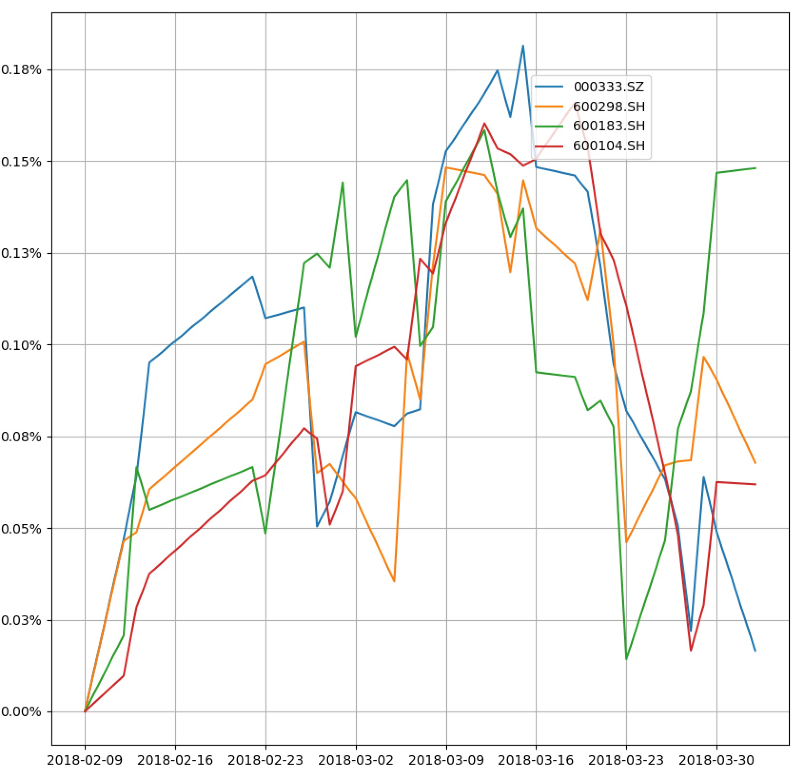

# yuna
目标：用算法来分析标的

支持的数据源
-----------------

- `Wind资讯:`  http://www.dajiangzhang.com
- `网极API(暂时不可用):` http://help.api51.cn/352770


基本使用以及CLI
----------

基本相关参数设定
```buildoutcfg
>>>import yuna
>>>yuna.setup(host='localhost', 
              port=3306, 
              user='root', 
              pass_wd='lvzhi', 
              db='yuna', 
              app_code='yuna',
              SOURCE = 'WindpySource', 
              DESTINATION = 'MysqlDestination')
```

数据库更新一只，多只或全部股票特定范围的收盘价
```
>>>yuna.update("002614", "20170601", "20180117")
>>>yuna.update(["002614", "300550"], "20170601", "20180117")
>>>yuna.update("all", "20170601", "20180117")
```
```
$ yuna u 002614 -f 20170601 -t 20180117
$ yuna u 002614 300550 -f 20170601 -t 20180117
```

清空数据库里的数据
```
>>>yuna.delete()
```
```
$ yuna d
```

查询特定股票的特定指标值，支持字符串查询
```
>>>yuna.query(['002614', '300550'], 'macd,kdj')
```

查询特定股票的特定指标值，并以视图模式输出，支持字符串查询
```
>>>yuna.query(['000333', '600298', '600183', '600104'], "kdj,macd,relate")
```


查询当前有哪些指标处于可用
```
>>>yuna.all_index()
```
