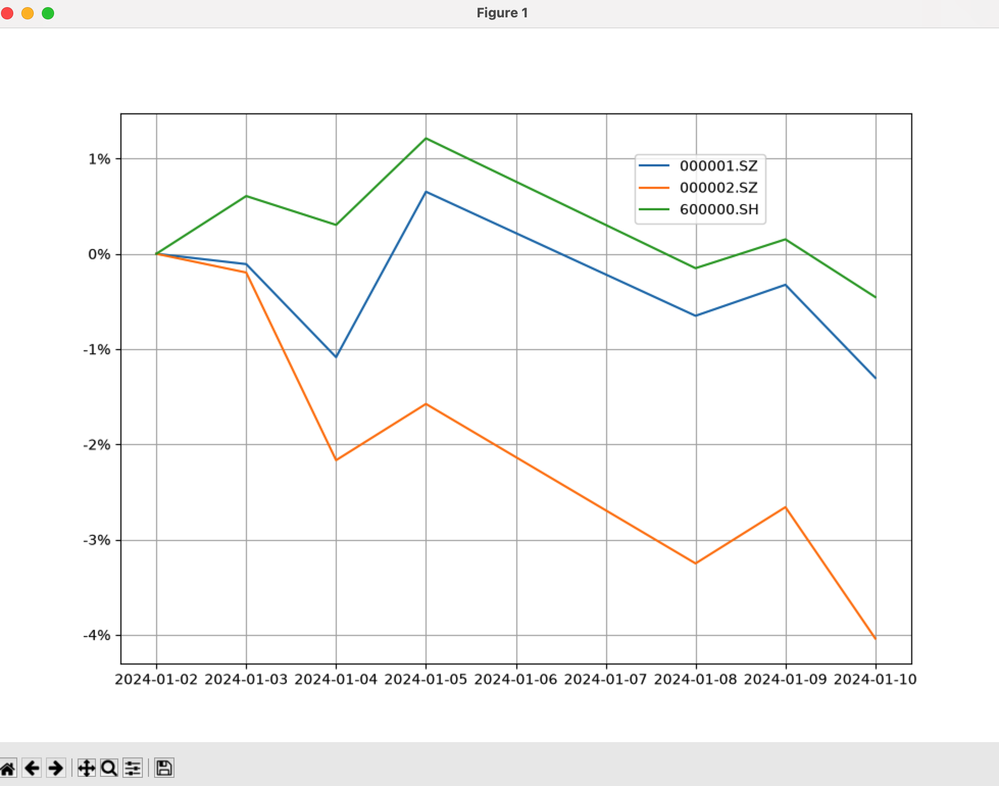

# yuna

量化分析工具包（A 股股票技术指标计算）

## 安装

```bash
git clone https://github.com/Na0ture/yuna
cd yuna
python3 -m pip install -e ".[dev]"
python3 -m pip install tushare
```

## 快速开始（TuShare Pro + HDF5，无需 MySQL）

### 1. 注册获取 token

前往 [tushare.pro](https://tushare.pro) 注册 → 个人主页获取 token（免费）。

### 2. 配置

```python
import yuna

yuna.setup(
    TUSHARE_TOKEN='你的token',
    SOURCE='TuShareSource',
    DESTINATION='Hdf5Destination',
)
```

### 3. 获取数据

```python
# 单只股票
yuna.update('000001', '20240101', '20240110')

# 多只股票
yuna.update(['000001', '000002', '600000'], '20240101', '20240110')

# 全部股票（3500+ 只，谨慎，免费 token 有频次限制）
yuna.update('all', '20240101', '20240110')
```

### 4. 计算指标

```python
# 单只股票，单个指标
result = yuna.query('000001', 'ma')

# 多只股票，链式指标
result = yuna.query(['000001', '000002', '600000'], 'kdj,macd,relate')

# 指定日期范围
result = yuna.query(['000001', '000002'], 'kdj,macd', '20240101', '20240110')
```

### 5. 查看指标值

`query` 返回 `Truck` 列表，每个 Truck 以**指标名**为键附加计算结果：

```python
result = yuna.query('000001', 'ma,kdj')
truck = result[0]

print(truck['Ma'])       # MA 值列表
print(truck['Kdj'])      # KDJ 值列表 [K, D, J]
print(truck['Close'])    # 原收盘价（基础字段）
```

### 6. 查看可用指标

```python
yuna.all_index()
# → ['boll', 'ema', 'kdj', 'ma', 'macd', 'rsi', 'sma']
```

### 7. 清空数据

```python
yuna.delete()
```

## CLI 用法

```bash
# 更新数据
yuna u 000001 -f 20240101 -t 20240110

# 查询指标
yuna q 000001 -i macd,kdj
```

## 数据源

| 数据源 | 状态 | 备注 |
|--------|------|------|
| **TuShare Pro** | ✅ 已验证 | 推荐，需注册获取 token |
| Wind 资讯 | ⚠️ | 需安装 Wind 金融终端 |
| 网极 API | ⚠️ | 可能已不可用 |

## 存储后端

| 后端 | 状态 | 备注 |
|------|------|------|
| **HDF5** | ✅ 推荐 | 无需额外服务 |
| MySQL | ⚠️ | 需 MySQL 服务 |

## 配置项

`TUSHARE_TOKEN`, `SOURCE`, `DESTINATION`, `HOST`, `PORT`, `USER`, `PASS_WD`, `DB`, `APP_CODE`

## 示意图


